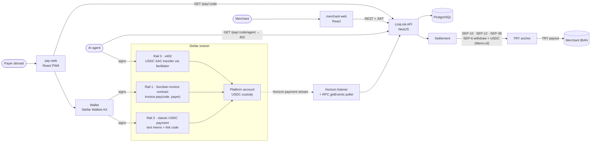

# Architecture

> The system at a glance, and the storage and authorization patterns of the Soroban invoice
> contract. Contract and data model: [`00-PROJECT.md`](00-PROJECT.md). Anchor flow:
> [`anchor.md`](anchor.md).

## System diagram

**Reading it:**
- The **merchant** only ever touches merchant-web, which talks to the API; the API owns Postgres.
- The **payer** opens pay-web, which reads the quote from the API and hands the transaction to the
  payer's own wallet. The wallet signs one of three rails; every rail ends with USDC in the platform
  account.
- The API learns about payments **from the chain**, not from the browser: a Horizon stream on the
  platform account (memo and x402 rails) and an RPC `getEvents` poller on the contract (contract
  rail). `POST /pay/:code/submitted` only speeds detection up.
- A paid link becomes a **settlement**, which withdraws the USDC through the anchor over SEP-6; the
  anchor pays lira to the IBAN registered over SEP-12.

## Soroban storage and auth patterns

The invoice contract (`contracts/invoice`) is small on purpose: it records an invoice, lets exactly
one payer settle it for exactly the recorded amount, and emits events the API follows.

### What lives where

| Key | Storage | Why |
|---|---|---|
| `Token` — the USDC SAC address | **instance** | Contract-wide config, set once by the constructor, read on every `pay`. Instance storage is loaded with the contract and shares its TTL, which is right for a handful of small, always-needed values |
| `Admin` — the platform account | **instance** | Same: contract-wide, tiny, read on every `create` / `cancel` |
| `Invoice(code)` — `{ merchant, code, amount, deadline, status, payer }` | **persistent** | One entry per link, unbounded in number. Each has its own TTL, so a busy contract never drags every invoice into the instance footprint, and an old invoice can archive without affecting the rest |

Nothing uses **temporary** storage: an invoice must never disappear silently while it can still be
paid, and a paid or cancelled one must stay readable for reconciliation.

### TTL / `extend_ttl` strategy

Ledgers close every ~5 s, so one day ≈ 17,280 ledgers.

- **Instance:** every write (`__constructor`, `create`, `pay`) calls
  `extend_ttl(threshold = 29 days, extend_to = 30 days)`. Because the threshold sits just below the
  target, the bump is a no-op on most calls and only pays rent roughly once a day of activity.
  `cancel` does not bump the instance; `get` never writes, so it bumps nothing.
- **Invoice entries:** on `create`, the entry is extended to live until **`deadline` + 30 days**:
  `extend_to = (deadline − current_ledger) + 30 days`. A pending invoice can therefore never be
  archived before it expires, and stays readable for a month after. On `pay` and `cancel` it is
  re-extended to **now + 30 days** — the reconciliation window after the final state. Invoice
  bumps pass the same value as threshold and target, so they always take effect.
- Every value is capped at `env.storage().max_ttl()`, so a far-future deadline cannot make a call
  fail.
- The API does not rely on archived invoices: the Postgres link row is the durable record, and the
  on-chain invoice is the enforcement mechanism while the link is payable.

### Where `require_auth` is enforced

| Function | Who must authorize | Enforced by |
|---|---|---|
| `__constructor(token, admin)` | the deployer (deploy transaction) | runs once at deploy; pins `Token` and `Admin` |
| `create(merchant, code, amount, deadline)` | **admin** | `require_admin` reads `Admin` from instance storage and calls `admin.require_auth()` before anything else |
| `cancel(code)` | **admin** | same `require_admin` |
| `pay(code, payer)` | **payer** | `payer.require_auth()` is the first statement; the SAC `transfer(payer → merchant, amount)` then runs under that same authorization |
| `get(code)` | nobody | read-only |

Design choices behind this:
- **Merchants never sign.** They are custodial, so `merchant` is only a payout address. An earlier
  design that required merchant auth on `create` / `cancel` could never be satisfied and was
  replaced by admin auth.
- **The payer controls only their own money.** `pay` cannot move anyone else's funds, cannot choose
  the amount (it is read from storage) and cannot choose the recipient (it is the stored `merchant`).
- **State checks follow auth:** `NotFound`, `NotPending` (no double pay, no paying a cancelled
  invoice) and `Expired` (`ledger > deadline`) are checked before the transfer, and the status is
  written as `Paid` in the same invocation, so a failed transfer reverts everything.
- **Events are the integration surface:** `created`, `paid`, `cancelled`, with topics
  `[name, code]`, are what the API's `getEvents` poller consumes.

### Live deployment

Testnet contract `CCXHJK4Y667EDKM5H3CXKP26V3LRVOH6NULYS5K6T4BKQADSSFL23BIA`, built from
`contracts/invoice` (wasm hash `f95d67fe…0950`). Constructor args, deployer and the redeploy
command: [`00-PROJECT.md` §7](00-PROJECT.md#7-soroban-invoice-contract).
